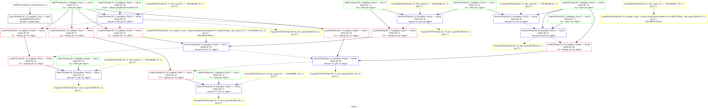
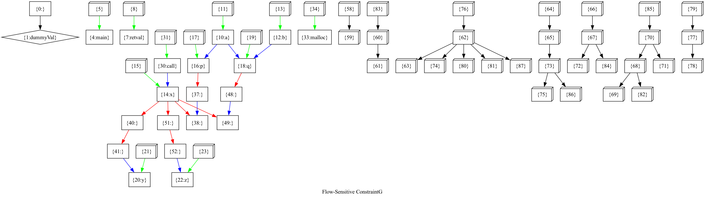

In preparing this artifact, we have modified files from an open-source project. As part of this process, we have removed the original author's name from the modified files to ensure anonymity. However, some unmodified files may still contain references to the original author, as removing them entirely could impact the integrity of the artifact. We have made a reasonable effort to maintain double-blinding while ensuring the artifact remains functional and true to its source.

## Flow Sensitivity without Control Flow Graph: An Efficient Andersen-Style Flow-Sensitive Pointer Analysis

This is an artifact for the paper submitted to OOPSLA 2025.

Flow-sensitive pointer analysis constitutes an essential component of precise program analysis for accurately modeling pointer behaviors by incorporating control flows. Flow-sensitive pointer analysis is extensively used in alias analysis, taint analysis, program understanding, compiler optimization, etc. Existing flow-sensitive pointer analysis approaches, which are conducted based on control flow graphs, have significantly advanced the precision of pointer analysis via sophisticated techniques to leverage control flow information. However, they inevitably suffer from computational inefficiencies when resolving points-to information due to the inherent complex structures of control flow graphs.

We present Cg-FsPta, a *Flow-Sensitive Constraint Graph* (FSConsG) based flow-sensitive pointer analysis to overcome the inefficiency of control-flow-graph-based analysis. Cg-FsPta uses a flow-sensitive variant to leverage the structural advantages of set-constraint graphs (which are commonly used in flow-insensitive pointer analysis) while keeping the flow sensitivity of variable definitions and uses, allowing the incorporation of sophisticated graph optimization and dynamic solving techniques. In this way, Cg-FsPta achieves significant efficiency improvements while keeping the precision of flow-sensitive analysis. Experimental evaluations on benchmark programs demonstrate that Cg-FsPta, which leverages the FSConsG to simplify graph structure and significantly reduces both memory usage and execution time while maintaining precision. In particular, by solving in the FSConsG, Cg-FsPta achieves an average memory reduction of 33.05% and accelerates flow-sensitive pointer analysis by 7.27×× compared to the state-of-art flow-sensitive pointer analysis method. These experimental results underscore the efficacy of Cg-FsPta as a scalable solution to analyze large-scale software systems, thus establishing a robust foundation for future advancements in efficient program analysis frameworks.

## How to setup

source build.sh

source setup.sh

## How to run

### Dump SVFG

wpa -fspta -dump-vfg fs-example.ll

The SVFG could be shown like below.

### Dump FSConsG

wpa -fsscd -dump-fs-consg fs-example.ll

The FSConsG could be shown like below.

### Run SUPA

wpa -fspta fs-example.ll

### Run CG-FSPTA

wpa -fsscd fs-example.ll